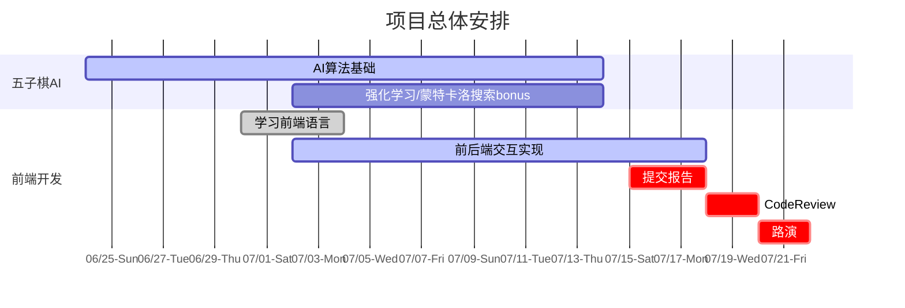

## 程序设计与数据结构III 五子棋项目
负责人：陈律达 胡锦波

Codebase Credit: [张志成](https://github.com/Gabr1e1)

Document Credit: [陈文迪](https://github.com/ChenWendi2001) 游灏溢

### 课程内容

- 基于树搜索的棋类AI设计基本思想与相关算法
- *基于强化学习和自我博弈的现代AI算法（以AlphaZero为例）
- Web前端开发与前后端交互技术


### 开发指南

#### 环境

- 请使用Unix环境开发（如WSL，MacOS）

- 除了C++外还需要配置python环境。请注意，必须使用python3.7版本及以上。

- 完成本项目至少需要以下python包

  ```
  subprocess
  timeout_decorator
  numpy
  sys
  time
  Flask
  ```

  你可以使用

  ```
  pip install -r requirements.txt
  ```

  来安装包依赖，如遇到安装包依赖相关的困难请及时提出。

#### API

请参照`judge/sample.cpp`的格式实现你的AI，其中：

- `init`: 初始化函数，会在程序开始的时候被调用

- `action(loc)`: `loc`参数为对手采取的行动，需要返回你在这步落子的位置，**注意：** 如果是第3步，返回`(-1,-1)`表示交换颜色，返回坐标表示不选择换手，正常下棋

- `ai_side`变量表示你的AI是哪一边，0黑1白，`ai_name`可以任意填写

 `AIController.h`包含了程序主函数，不需要进行修改

#### 算法评测

- 运行方式：编译你的AI，接着执行`python judge.py ai0path/human ai1path/human`，写在前面的表示先手，后面的表示后手，例如：`python judge.py ./sample human`
- judge文件夹中含有一个**棋力不弱**的五子棋AI源码：`baseline.cpp`，你可以用`g++`编译生成二进制文件，用于测试AI的能力。
- **Tips：** 你可以通过更改judge.py来输出更多信息

#### 前后端交互

- 请根据相关资料学习HTML语言+CSS语言打造一个可以交互的前端，学会简单的JavaScript语言实现命令处理。利用JavaScript的canvas功能搭建一个可展示的五子棋界面，可使用浏览器直接打开html文件预览效果。

- 请自学[Flask - python](https://www.w3cschool.cn/flask/)和[AJAX - jQuery](https://www.runoob.com/jquery/jquery-ajax-get-post.html)相关内容，参照demo中的例子完成后端算法的对接，并将其应用于你的网页上，实现前后端交互。

- 运行方式：完成前后端交互代码后执行 `python run.py`，在命令行中你将看到类似于如下输出

  ```
  dantynomac@dantynoel demo % python run.py 
   * Serving Flask app 'run'
   * Debug mode: on
  WARNING: This is a development server. Do not use it in a production deployment. Use a production WSGI server instead.
   * Running on http://127.0.0.1:5000
  Press CTRL+C to quit
   * Restarting with stat
   * Debugger is active!
   * Debugger PIN: 144-469-127
   ...
  ```

  其中包含了一个url（这里是 http://127.0.0.1:5000 ），在浏览器中输入该网址即可。

- 关于使用无图形界面的其他Ubuntu模拟器的同学，若浏览器无法访问，这里有两种办法：

  1. 下载并安装图形界面，在Ubuntu内用浏览器打开
  2. 自行配置网路分发端口，让宿主机能访问虚拟机

### 项目要求

- **AI单步推理时间限制：5s**
- 必做：实现Minimax搜索，alpha-beta剪枝，性能优化（例如启发式搜索，Zobrist缓存，迭代加深搜索，算杀），支持人机对战的前端以及前后端交互
- 选做：蒙特卡洛树搜索，强化学习相关算法的探索，或是其他创新性的优化策略
- 40% 算法实现（包括与baseline的对战以及小组内对抗赛）
- 20% 前端展示
- 40% Code Review&Report



*蓝色条带仅代表课程内建议的各项目完成时间节点，仅供参考。*

*红色竖线代表今日，请把握时间。*

- **请勿抄袭或共享五子棋AI算法的具体代码**

- 请在最终提交的五子棋算法中加入适量的随机算法，防止最终测试的时候胜率误差较大，可以参考[开局库](https://www.xqbase.com/computer/book.htm)

- 五子棋算法提交的截止日期为7.14 （第三周周末）23:59

- 前端提交的截止日期为7.18 （第四周周三）23:59

- 前端开发若有代码引用部分请注明出处，并标明自己完成了哪些内容

- 完成一篇简短的报告，报告提交的截止日期为7.18（第四周周三）23:59，报告中须包含以下内容：

  1、应用的五子棋AI的算法以及优化

  2、本地运行与baseline对战的胜率

  3、前端界面展示以及所支持的所有操作

  4、完成前后端过程中遇到的问题以及所做的优化

### 可供学习的参考资料

#### 算法
- **算法基础教程：https://github.com/lihongxun945/myblog/issues/11**
- MCTS：https://www.geeksforgeeks.org/ml-monte-carlo-tree-search-mcts/
- AlphaZero论文：https://www.science.org/doi/10.1126/science.aar6404

#### 前端
- W3Schools： https://www.w3school.com.cn/
- jQuery教程： https://www.runoob.com/jquery/jquery-tutorial.html

